# 基于SpringBoot的建筑材料管理系统的设计与实现

> 公开脱敏版：保留论文正文与技术插图；学校模板、页眉页脚、校徽、身份元数据不进入公开文件，含个人资料或凭据的截图已隐藏。

目 录

## 绪论

### 主要研究内容

本研究的主要内容是基于微服务架构的建筑材料管理系统。通过软件工程的角度，我们将对该系统进行全面而深入的分析与讨论。首先，我们将进行系统的需求分析，深入了解用户的实际需求以及建筑行业的特点。其次，我们将详细阐述系统的设计与架构，包括架构设计，功能设计，数据库设计等。在系统设计中，我们将实现两种主要服务：用户服务和业务服务，同时采用RBAC模型进行权限控制，以确保系统的安全性和稳定性。在业务功能方面，我们将实现工地管理、材料管理等核心功能，并通过微服务的方式实现服务的解耦和灵活性。最后，我们将对系统进行黑盒测试，验证系统的功能完整性和稳定性，为建筑行业数字化转型提供可靠的管理解决方案。

### 1.1 选题背景

在当今信息技术飞速发展的时代背景下，建筑行业作为全球经济的重要支柱之一，扮演着至关重要的角色。然而，传统的建筑材料管理方式存在着诸多挑战，包括但不限于供应链不透明、库存管理不精细、订单处理效率低下、质量监管不到位等问题。这些问题不仅影响了建筑项目的进展和成本，还可能导致资源浪费、生产延误以及客户满意度下降等不良后果。

为了解决这些痛点，建筑行业迫切需要一套高效、智能的建筑材料管理系统。基于微服务架构的建筑材料管理系统应运而生，借助先进的信息技术手段，如云计算、大数据、人工智能等，将建筑材料的采购、供应链管理、库存控制、订单处理、质量监管等环节进行优化升级，实现全流程的数字化、智能化管理。

此外，随着城市化进程的加速和人们对生活品质的不断追求，建筑行业对于建筑材料的需求量也在不断增长，因此，建筑材料管理系统的研发应用将在促进建筑行业数字化转型的过程中发挥重要作用，为建筑企业提供更高效、更智能、更可持续的管理解决方案，推动建筑行业迈向数字化、智能化的新时代。

### 1.2 国内外发展现状

建筑行业的数字化转型正迅速推动着建筑材料管理系统的需求增长，这一趋势不仅在国内，也在国际范围内得到了显著体现。举例来说，在国外，像美国、德国等发达国家早已采用先进的建筑材料管理系统。这些系统通过数字化和智能化手段，极大地提升了建筑生产效率、降低了成本、提高了建筑质量，为建筑行业的可持续发展奠定了基础。

比如，在美国，许多建筑企业采用先进的建筑材料管理系统，实现了供应链管理、库存控制、订单处理、质量监管等方面的精细化管理。通过系统优化，建筑企业不仅可以及时掌握材料供应情况，还能够有效控制库存成本，降低物流成本，提高施工效率。这些举措不仅带来了巨大的经济效益，还使企业在激烈的市场竞争中保持了竞争优势。

而在国内，随着中国经济的快速发展和城市化进程的加速推进，建筑行业迎来了历史性的发展机遇。然而，面对市场竞争和管理挑战，传统的管理方式已经难以满足市场需求。因此，越来越多的建筑企业开始重视引入先进的建筑材料管理系统，以提升管理水平和竞争力。

举个例子，在中国的一些知名建筑企业，如中国建筑、中建三局等，已经开始尝试使用微服务架构的建筑材料管理系统。通过这些系统，他们可以实现材料采购、库存管理、工地调度等方面的智能化管理，有效地提高了项目的管理效率和成本控制水平。这些成功案例引起了更多企业的关注和跟进，预示着微服务架构的建筑材料管理系统将在中国建筑行业迅速普及和应用。

总的来说，国内外建筑行业对于建筑材料管理系统的发展趋势是一致的，即通过数字化、智能化的手段实现建筑材料管理的精细化、高效化、智能化。基于微服务架构的建筑材料管理系统将成为未来建筑行业数字化转型的重要工具，为建筑企业提供更高效、更智能、更可持续的管理解决方案，推动建筑行业朝着数字化、智能化、可持续发展的方向迈进。

### 1.3研究目的与意义

选题的意义在于满足建筑行业快速发展的需求，提升建筑材料管理效率、降低成本、减少浪费，同时也契合了信息技术和数字化时代的发展趋势。具体而言，这一选题的意义体现在以下几个方面：

提高管理效率：基于微服务架构的建筑材料管理系统可以实现信息的高度集成和自动化处理，减少了繁琐的手工管理工作，提高了管理效率。建筑项目涉及众多材料种类和供应商，系统能够迅速、准确地管理各种材料信息，有助于提升项目进度。

降低管理成本：系统的数字化管理方式降低了纸质文档的使用和存储成本，同时也减少了人力资源的浪费。此外，系统的智能分析功能有望帮助企业优化采购策略，降低采购成本，提高投资回报率。

可持续发展：建筑业是全球资源消耗的重要领域，通过提高建筑材料的有效利用，降低浪费，有助于减少资源浪费，符合可持续发展的要求。

推动技术创新：该选题推动了信息技术在建筑业的应用创新。通过引入Vue、Nacos等现代技术，有望为建筑业注入新的活力，推动行业的数字化升级。

提高竞争力：建筑行业竞争激烈，采用现代化管理系统将有助于企业提高竞争力，赢得更多项目和客户信任。

综上所述，基于微服务架构的建筑材料管理系统的建设不仅有利于提升建筑行业的管理效率，降低成本，还符合可持续发展的要求，同时也推动了信息技术在建筑业的创新应用，为企业带来更多商机和竞争优势。这一选题具有重要的现实意义和未来发展潜力。

### 1.4 内容安排

## 第一章是绪论部分，主要讲述本选题的研究背景，研究意义，国内外发展现状与全文概述；

## 第二章为技术实现介绍，介绍实现本系统需要使用哪些技术，框架，需要了解哪些原理；

## 第三章是需求分析章节，以用例图加文字对本系统的功能进行分析与描述，然后在结合需要使用到的技术进行是否可行，是否安全，是否符合市场发展等分析；

## 第四章是系统设计，对系统功能架构，功能流程，数据库进行设计；

## 第五章是系统实现，介绍功能的实现过程与实现结果展示，然后贴出重要功能的主要代码进行讲述；

## 第六章是测试部分，测试系统的主要功能是否可以正常运行。

## 第七章是总结部分，进行全文总结与不足的提出，还有对未来的展望。

## 第2章 关键技术介绍

### 2.1 后端技术

#### 2.1.1 Spring Boot

Spring Boot是一款用于简化Spring应用开发的框架。其关键技术包括自动配置、起步依赖、Actuator、Spring Boot CLI等。自动配置通过约定大于配置的原则，根据应用的依赖和配置自动配置Spring应用的运行环境。起步依赖提供了一系列预配置好的依赖库，可以快速启动各种类型的应用。Actuator为应用提供了生产级别的监控和管理功能，包括健康检查、性能监控等。Spring Boot CLI是一个命令行工具，可以用于快速原型开发和快速创建Spring Boot应用。这些关键技术使得Spring Boot能够以简洁、快速的方式开发生产级别的Spring应用。

本系统采用Spring Boot框架搭建服务端，以提供系统前端所需的数据处理服务。同时，系统的多个服务均采用了Spring Boot框架作为基础架构。Spring Boot提供了一致性的开发模式和简洁的配置，使得各个服务之间能够更加高效地协同工作，如图2.1所示。

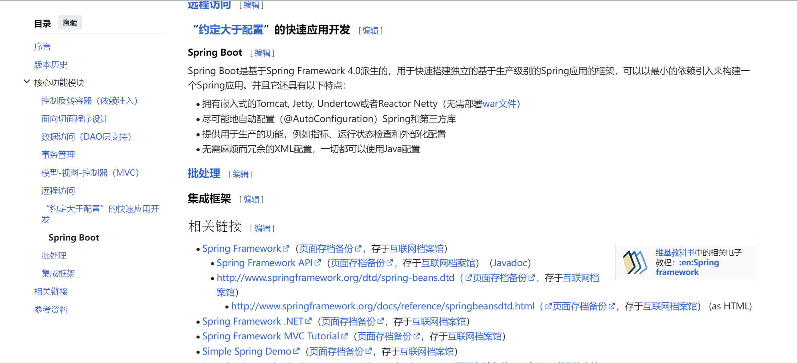

图2.1 Spring Boot

#### 2.1.2 Nacos

Nacos（Dynamic Naming and Configuration Service）是阿里巴巴开源的一款用于动态服务发现、配置管理和服务治理的分布式系统。作为云原生时代的服务注册与发现中心。

Nacos作为一款全功能的服务注册与发现中心，为云原生时代的微服务架构提供了强大的基础设施支持，帮助用户实现服务治理、动态配置管理和流量控制等关键功能，从而加速应用的开发和部署，提升系统的稳定性和可靠性。

本系统采用Nacos作为服务注册与发现中心，用于管理系统内诸多服务，包括用户服务、建筑材料服务、采购服务、工地服务等。通过Nacos，系统实现了服务的统一注册与发现，实现了服务之间的自动化发现和访问。同时，系统还利用Nacos实现了统一路由分配和统一配置管理，使得服务之间能够更加高效地通信和协同工作。统一路由分配功能可实现流量的智能调度和负载均衡，确保系统的高可用性和稳定性；而统一配置管理功能则能够集中管理系统的配置信息，实现配置的动态更新和实时生效，从而提升了系统的灵活性和可维护性。通过Nacos作为服务注册与发现中心，系统能够更加便捷地实现服务治理，满足系统对于服务管理、流量控制和配置管理等方面的需求，为系统的稳定运行和持续发展提供了坚实的基础支撑，如图2.2所示。

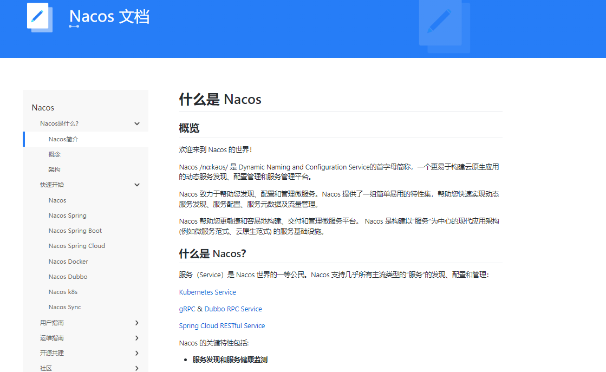

图2.2 Nacos

#### 2.1.3 MySQL数据库

MySQL是一个小型关系型数据库管理系统，开发者为瑞典MySQL AB公司。MySQL AB是一家基于MySQL开发人员的商业公司，它是一家使用了一种成功的商业模式来结合开源价值和方法论的第二代开源公司。MySQL是MySQL AB的注册商标。MySQL的SQL“结构化查询语言”。SQL是用于访问数据库的最常用标准化语言。MySQL软件采用了GPL（GNU通用公共许可证）。由于其体积小、速度快、总体拥有成本低，尤其是开放源码这一特点，许多中小型网站为了降低网站总体拥有成本而选择了MySQL作为网站数据库。

MySQL是一个快速的、多线程、多用户和健壮的SQL数据库服务器。MySQL服务器支持关键任务、重负载生产系统的使用，也可以将它嵌入到一个大配置(mass-deployed)的软件中去。

#### 2.1.4 MyBatis

Mybatis是一个基于Java语言的持久层框架，Mybatis不仅支持普通的SQL查询，存储过程和高级映射，而且消除了许多JDBC代码以及手动设置参数和结果集的检索。 Mybatis仅仅使用简单的XML或批注便能进行配置和原始映射。

Sqlsessionfactory实例是Mybatis应用程序主要使用的实例，其主要通过Sqlsessionfactorybuilder获得。而Sqlsessionfactorybuilder主要获取于XML配置文件。

可以对SQL语句进行预编译处理，防止SQL注入攻击。

### 2.2 前端技术

Vue.js 是一款轻量级、高效且易于上手的 JavaScript 框架，用于构建用户界面和单页面应用。Vue 的核心特性包括声明式渲染、组件化、响应式数据绑定和虚拟 DOM，使得开发者能够更高效地构建可维护和可扩展的 Web 应用。Vue.js 支持插件系统和周边生态，例如 Vuex（状态管理）和 Vue Router（路由管理），进一步提升了其在复杂项目中的实用性。

### 2.3 本章小结

本章详细阐述了在系统构建中所采用的多项关键技术，包括Vue前端框架、Nacos、MySQL数据存储、Spring Boot后端框架。这些技术的有机结合使得系统具备了强大的功能和性能，并为用户提供了优质的体验。

对这些技术的深入探讨和优化补充，使得系统的设计更加完善，功能更加丰富。将以上技术的巧妙整合，系统在性能、用户体验和功能上都达到了不错的水平。并且对技术的深入研究和优化不仅提高了系统的整体质量，也为以后的拓展和升级有着一定的帮助。

## 第3章 系统分析

### 3.1 功能需求分析

本建筑材料管理系统旨在有效管理建筑工地的材料投入。其主要功能包括建筑材料的采购、供应商和经销商管理、材料在工地的投入以及成本计算等。为了更好地管理数据、实现功能区分和权限控制，系统采用了基于角色的访问控制（RBAC）模型。通过RBAC模型，系统可以根据用户的角色和职责分配不同的权限，确保用户在系统中只能访问其需要的功能和数据。这种权限分类和管理机制有助于提高系统的安全性和可靠性，防止未授权的访问和操作。此外，系统还注重材料使用的透明化，通过记录和追踪材料的采购、投入和使用情况，实现对材料流程的全程监控和跟踪。通过这种方式，可以及时发现和解决材料使用中的问题，提高材料利用率和工地效率，进而提升整个建筑工程的质量和效益。

图3.1用户用例图

根据需求分析，本系统采用RBAC权限模型，支持多种权限用户，并且不同权限的用户具有不同功能。因此，我们将以管理员用户为例进行用例分析，管理员用户拥有系统的所有功能权限。用例图如图3.1所示，展示了管理员用户在系统中可以执行的各种功能操作，包括建筑材料的采购、供应商和经销商管理、材料在工地的投入以及成本计算等。

系统功能包括材料管理、报价信息管理、采购管理、工地信息管理、供料管理、登录、用户管理和个人信息修改。材料管理涵盖类别管理和库存管理，支持材料基本信息录入、采购申请、报价信息录入和价格分析。采购管理实现申请、审核、入库流程控制，提供我的采购和采购统计功能。工地信息管理包括工地状态管理和工程时间管理。供料管理支持材料投入、数量判断和使用情况更新。登录功能提供账号密码登录和权限获取。用户管理实现用户增删改授权操作。个人信息修改允许用户修改个人信息。系统设计旨在提高材料管理效率、数据透明度和用户体验，支持RBAC模型，确保权限分配与功能操作的有效性和安全性，详细用例描述如表3.1所示。

表3.1用例描述表

<table>
<tr><td>用例名称</td><td>用例描述</td></tr>
<tr><td>材料管理</td><td>包括材料类别的增删查改以及库存管理。用户可以录入材料基本信息并选择材料类型，进行采购申请，若无报价信息需新增，然后进行材料入库。所有操作需显示申请人、审核人、申请时间与审核时间，确保数据透明性</td></tr>
<tr><td>报价信息</td><td>用户录入经销商与生厂商关于某一材料的报价，支持Excel导入，进行数据校验，避免错误数据进入系统。用户可进行报价信息分析，主要分析材料价格走势，以帮助采购最优价格的材料。</td></tr>
<tr><td>采购管理</td><td>包括采购审核流程，状态为申请采购-审核-采购-入库。需做流程控制，显示审核人、审核时间、申请人与申请时间等信息。&quot;我的采购&quot;功能允许查看申请的采购计划及其状态，不可修改。采购统计可根据时间范围查询采购的材料数量与金钱，便于工程结束后的汇总。</td></tr>
<tr><td>建筑工地管理</td><td>可增删查改工地信息，包括开始时间、实际工程结束时间、计划结束时间和工地状态（在建、完成）。已完成的工地无法供料或修改。</td></tr>
<tr><td>供料</td><td>用户可选择库存中的材料投入工地，输入供料数量并进行数量判断，需小于仓库数量。支持追加供料功能。更新使用情况允许更新已供材料的使用情况，并计算消耗比。</td></tr>
<tr><td>登录</td><td>用户通过输入账号与密码进行系统登录，成功登录后获取用户角色类型，再根据角色类型获取相应权限。前端根据服务端返回的权限进行菜单展示。</td></tr>
<tr><td>用户管理</td><td>包括用户增加、修改、授权（授予角色，实现RBAC模型）和删除</td></tr>
<tr><td>权限管理</td><td>路由的增加与删除</td></tr>
<tr><td>个人信息修改信息修改</td><td>用户可修改个人基础信息，如昵称、密码等。</td></tr>
</table>

### 3.2 可行性分析

1. 技术可行性：建筑材料管理系统需要使用现代化的信息技术来支持其功能，包括数据库管理、Web开发、权限控制等方面的技术。现代的开发框架和工具能够满足系统的需求，并且已经有成熟的解决方案可供选择，因此从技术上来说，该系统是可行的。

2. 经济可行性：建筑材料管理系统的实施需要一定的投资，包括软件开发、硬件设备、人力资源等方面的成本。然而，考虑到该系统能够提高材料管理的效率、减少人力成本、降低材料损耗等方面的好处，以及未来的收益和节省的费用，从经济角度来看，该系统是可行的。

3. 法律可行性：在系统开发和运营过程中，需要遵守相关的法律法规，包括数据保护、隐私保护、知识产权等方面的法律规定。确保系统的合法性和合规性，避免出现法律风险，是项目成功的关键之一。

4. 时间可行性：建筑材料管理系统的开发和实施需要一定的时间，包括需求分析、设计、开发、测试、部署等阶段。必须合理规划项目进度，确保按时完成，并且在系统投入使用后能够及时提供支持和维护，以保证系统的稳定性和持续运行。

建筑材料管理系统在技术、经济、法律和时间等方面都具备可行性。它有望提高建筑材料管理的效率和透明度，减少成本，增加收益，为建筑工程提供更好的支持和管理，因此值得进一步实施和推广。

### 3.3 非功能需求分析

系统安全性分析是评估系统在设计、开发和运行过程中，针对安全威胁和风险采取的措施和策略，以确保系统数据和操作的安全性和保密性的过程。对于建筑材料管理系统的安全性分析如下：

1. 数据安全：建筑材料管理系统涉及大量的敏感数据，包括采购信息、报价信息、工地信息等。为保护这些数据的安全性，系统需要采取严格的数据加密、访问控制和权限管理措施。敏感数据应加密存储在数据库中，并且只有经过授权的用户才能访问和操作相关数据。

2. 身份认证与访问控制：系统应该实现严格的身份认证机制，确保只有合法的用户才能登录系统并访问相关功能。采用用户名密码、多因素认证等方式进行身份验证。此外，系统还应该根据用户角色和权限，实施细粒度的访问控制，限制用户的操作范围，防止未授权的访问和操作。

3. 安全审计与监控：建筑材料管理系统应具备安全审计和监控功能，记录用户的操作行为和系统事件，及时发现异常行为和安全事件。系统管理员可以通过审计日志和监控报警，及时采取措施应对安全威胁，保障系统的安全运行。

4. 网络安全：系统需要采取有效的网络安全措施，防范网络攻击和数据泄露风险。包括建立安全的网络架构、使用防火墙和入侵检测系统、加强对外部网络的访问控制等，以保护系统的网络通信安全。

5. 漏洞修补与更新：系统应定期对软件和硬件进行漏洞扫描和修补，及时更新系统补丁和安全更新，以防止已知漏洞被攻击利用，保障系统的稳定性和安全性。

建筑材料管理系统需要综合考虑数据安全、身份认证、访问控制、安全审计、网络安全等方面的安全问题，并采取相应的技术和措施来保障系统的安全性和稳定性。只有做好系统安全保护工作，才能有效防范安全威胁和风险，确保系统数据和操作的安全可靠。

### 3.4 本章小结

本章节详细梳理了系统需要实现的功能，确保了目标的清晰性和可操作性。通过从技术、法律和经济，时间四个关键角度进行可行性分析，系统设计的实施得到了全面评估，保证了系统的正常实现和投入使用。这一综合性分析为系统的可持续发展和顺利运行提供了坚实的基础和保障。这一章节的深入探讨不仅局限于功能需求的概述，更倾向于确保系统设计的全面性和可操作性。

通过多种关键角度的综合考量，系统的整个实施得到了充分的审核评估，进而为系统的顺利推进和长期运营打下了坚实的基础。这种综合性的分析不仅仅关注了系统本身的技术实现，而且涵盖了法律合规和经济可行性等多个方面，为系统在实践中的可持续性发展提供了全面的支撑和保障。

## 第4章 系统设计

### 4.1 架构设计与总体设计

1. 前端架构：Vue：使用Vue构架前端响应式界面。数据交互：通过Ajax进行前后端的数据交互，支持主要的HTTP请求类型，包括POST与GET。

2. 后端架构：Spring Boot框架：作为服务端的主要开发框架，提供快速搭建与开发的优势，支持RESTful API的开发。SSM架构：使用Spring、Spring MVC和MyBatis-plus的组合，实现了系统的业务逻辑、控制层和持久层的分离。全局异常与返回处理：实现全局异常处理机制，确保系统在面对异常情况时能够友好地向前端返回响应。数据交互与事务处理：利用ORM框架进行数据库操作，确保数据的一致性。采用声明式事务机制，保证用户操作的原子性。

3. 数据库：MySQL数据库： 作为主要的数据存储方案，存储用户，角色，权限，材料，经销商，供应商，工地等数据信息，系统软件架构图如图4.1所示。

图4.1 软件架构图

### 4.2 主要功能详细设计

#### 4.2.1 登录

登录时序图如图4.2所示，用户在前端输入账号和密码后，前端发送登录请求到后端。后端接收到请求后，如果用户不存在，则返回用户不存在提示；如果密码错误，则返回密码错误提示；如果登录成功，则查询用户信息、检查密码是否匹配、查询用户权限和导航菜单，生成令牌并返回给前端，前端在进行页面的跳转与令牌的缓存。

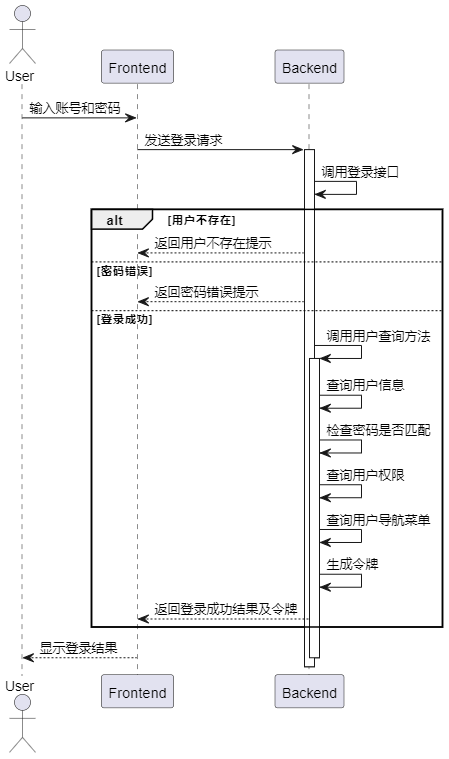

图4.2 登录时序图

#### 4.2.2 权限管理

用户登录成功后，会访问系统的菜单获取接口，客户端发起GET请求到Controller的/getAccountRight端点，传递了用户ID参数。Controller接收请求后调用Service层分别查询用户的导航和权限信息。Service层通过数据库查询相应数据，然后返回给Controller。Controller将导航和权限信息封装在一个结果对象中，返回给客户端，客户端根据结果进行菜单的渲染，时序图如图4.3所示。

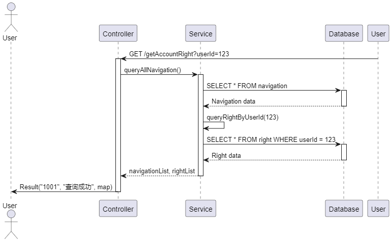

图4.3 动态菜单数据获取时序图

系统通过AOP切面的形式，进行后续的接口权限拦截验证，防止他人通过请求工具进行模拟请求，保护数据安全，首先定义注解@VerifyToken，然后定义拦截器，当用户发起HTTP请求时，Filter被激活并调用preHandle方法。在该方法中，首先检查请求是否映射到Controller上，然后验证token的有效性，包括token是否存在以及是否能够通过验证。接着，根据token中的用户ID查询数据库获取用户信息，并验证用户是否存在以及密码是否正确。最终，根据验证结果返回相应的处理结果，若验证失败或出现异常情况，则返回登录失效的提示信息；若验证通过，则放行请求，允许进入Controller处理后续逻辑。

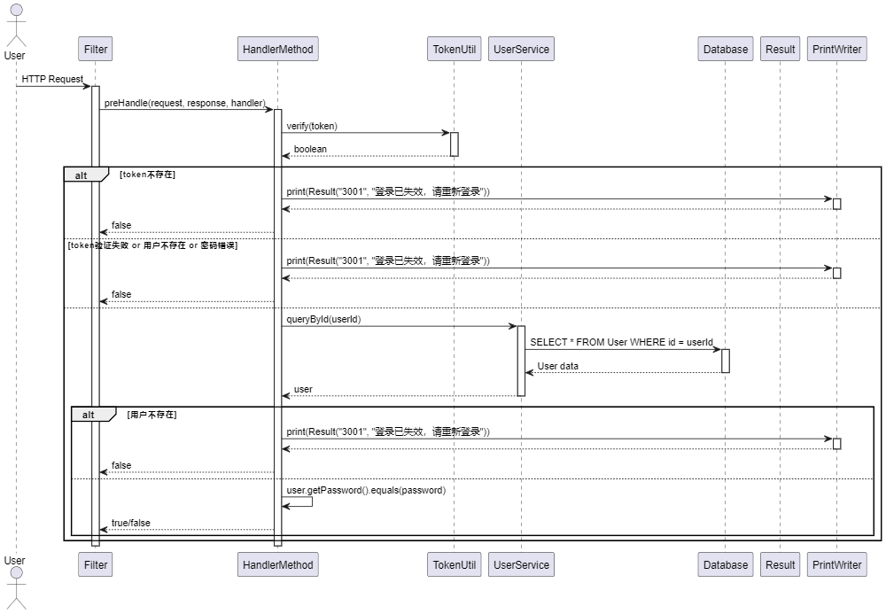

图4.4 拦截时序图

用户权限编辑时序图如图4.5所示，用户向系统发送POST请求以更新账户权限请求，服务端Controller接收到请求后调用Service层的updateAccountRight方法，该方法首先删除用户之前的权限信息，然后插入新的权限信息。最后，根据操作结果返回相应的授权成功或失败的结果给用户。

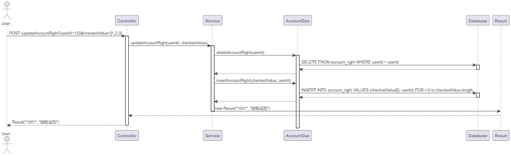

图4.5 权限用户编辑时序图

#### 4.2.3 报价信息

报价信息导入时序图如图4.6所示，首先，Controller接收到用户上传请求，随后调用Service层的导入方法。Service层利用ExcleAnalysisTool解析Excel文件，逐行验证数据的正确性并更新数据库。若发现数据有误，记录错误信息；若数据无误，将其插入数据库并更新相关信息。最终，返回导入结果给Controller，由Controller将结果传递给用户。

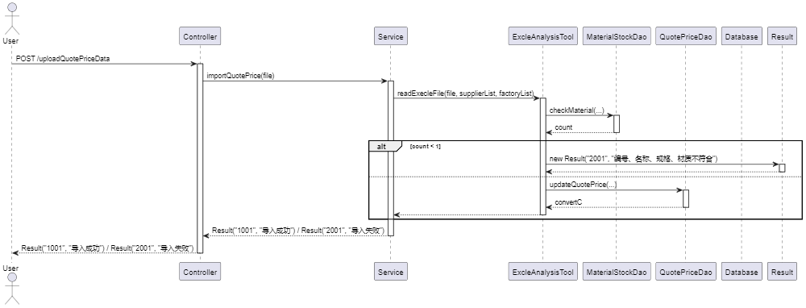

图4.6 报价导入时序图

报价信息查询统计时序图如图4.7所示，用户通过GET请求提供材料ID和时间范围，Controller调用Service层的方法进行处理。Service层根据参数查询相应的报价信息，并将其转换为图表数据格式。最终返回给用户查询成功的结果，包括x轴数据，然后客户端可以根据这些数据，进行图表展示，帮助用户进行材料性价比的分析，以此来节约资源。

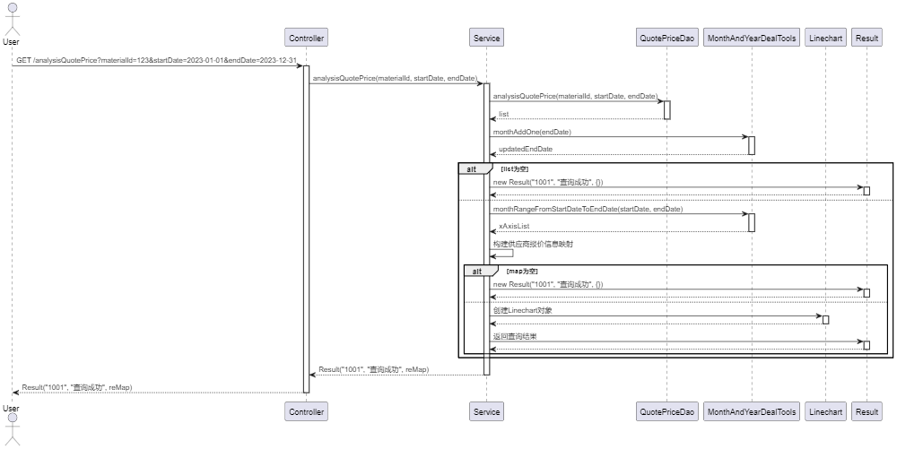

图4.7 报价信息查询统计时序图

#### 4.2.4 材料管理

材料新增时序图如图4.8所示，用户向Controller发送POST请求，Controller调用Service层的新增方法。Service层首先检查材料是否已存在，若不存在则插入新材料并返回新增成功的结果，否则返回材料已存在的结果。

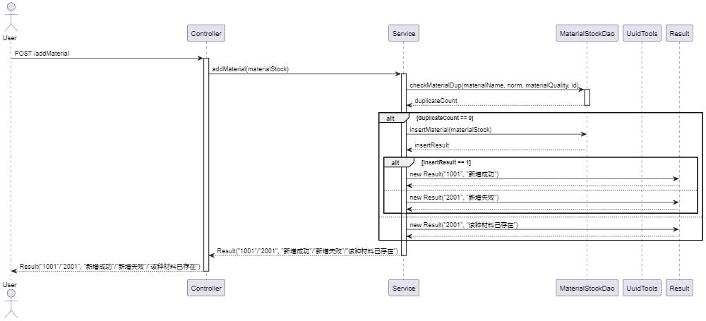

图4.8 材料新增时序图

#### 4.2.5 采购管理

材料新增成功后，即可进行采购计划的申请，用户通过POST请求提供所需信息，Controller调用Service层的方法进行处理。Service层根据提供的信息创建采购计划对象，并根据供应商和材料的最低起购量进行检查。若满足条件，则将采购计划添加到数据库中，并返回申请成功的结果；否则返回申请失败的结果，时序图如图4.9所示。

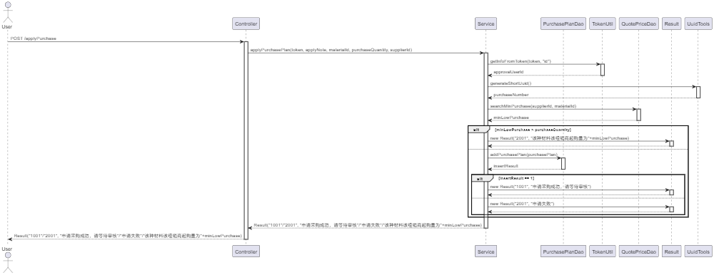

图4.9 采购申请时序图

采购申请审批时序图如图4.10所示，用户向Controller发送GET请求，Controller调用Service层的审批方法。Service层首先查询采购计划的旧状态，若不为0则返回状态不可操作的结果；否则，从token中获取审批人id，并更新采购计划的状态。最终，返回操作成功或失败的结果给Controller，由Controller将结果返回给用户。

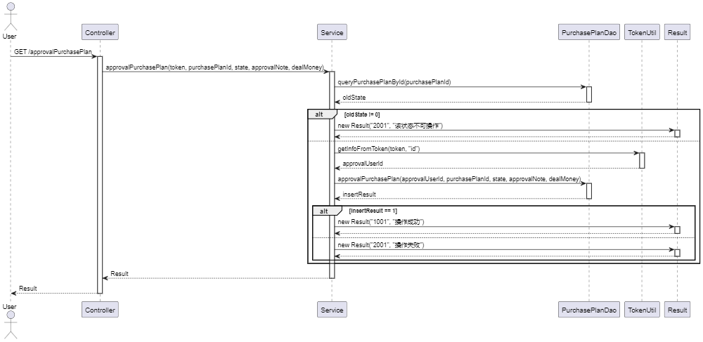

图4.10 采购申请审批时序图

审批通过的采购，可以进行材料的入库操作，如图4.11所示，用户向Controller发送POST请求，Controller调用Service层的方法进行处理。Service层首先更新采购计划的状态为已完成，并检查更新是否成功，若失败则返回材料入库失败的结果。然后查询对应的采购计划信息，若查询失败则同样返回材料入库失败的结果。最后，将采购的材料入库，并返回材料入库成功或失败的结果给用户。

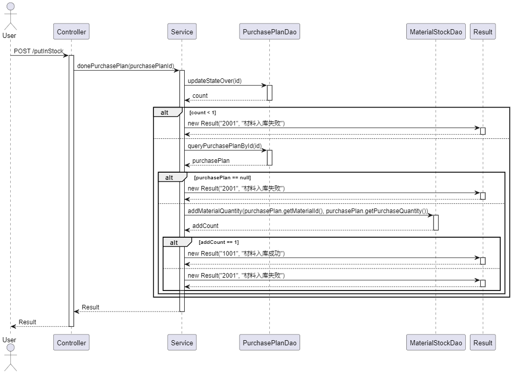

图4.11 入库时序图

#### 4.2.5 工地管理

工地投入材料时序图如图4.12所示，用户向Controller发送POST请求，Controller调用Service层的添加使用材料方法。Service层首先查询材料的库存量，若库存不足则返回相应提示信息；否则将使用信息添加到站点信息中，并更新材料库存量。最终返回投入材料成功或失败的结果给用户。

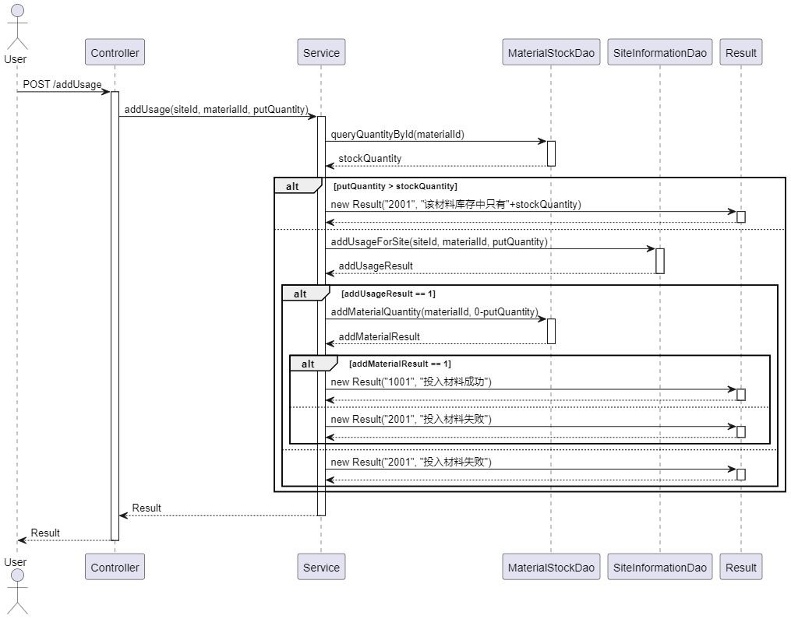

图4.12 材料投入时序图

工地查询时序图如图4.13所示，用户通过前端请求服务端的查询接口，服务端根据传入的工地ID、材料名称、使用类型、页码和每页大小参数，确定查询的使用百分比范围，然后调用SiteInformationDao查询相应范围内的材料使用情况列表和总记录数。最终将查询结果和总记录数封装到Result对象中，返回给用户，表示查询成功。若用户未提供使用类型，则默认查询全部类型。若查询条件未匹配到任何记录，则返回空列表和总记录数为0。

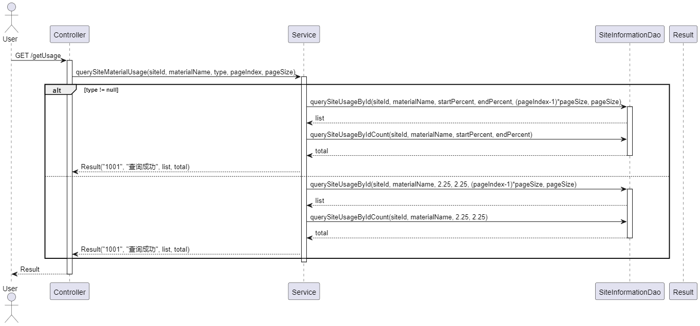

图4.13 工地查询时序图

### 4.3 系统数据库设计

#### 4.3.1 结构设计

用户对象与权限对象为一对多关系，权限与菜单为一对多关系，用户对象与采购为一对多关系，采购对象与经销商，供应商对象为一对多关系，然后材料与采购与一对多关系，然后工地对象与材料对象为一对多关系，因此系统的数据库关系如图4.14数据库关系图所示。

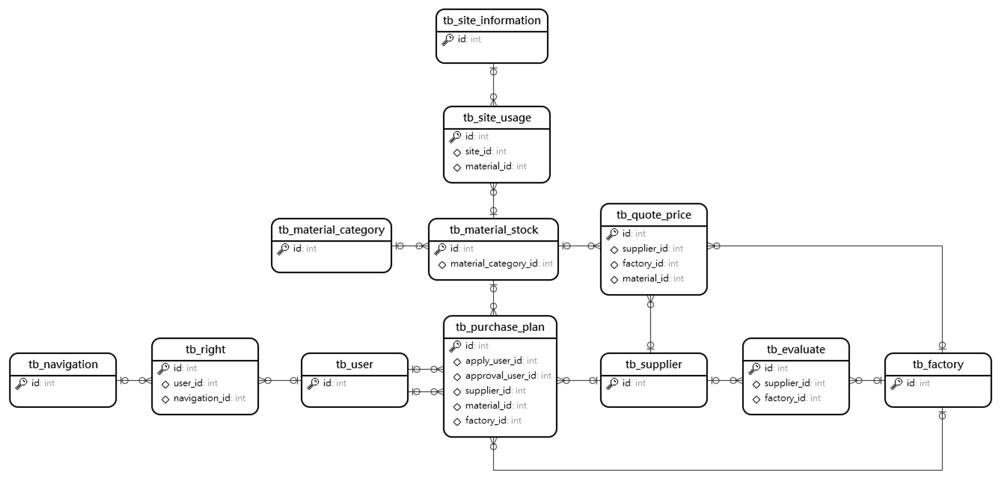

图4.14 E-R图

#### 4.3.2 表设计

用户表主要储存用户主键，真实姓名，密码等信息，其中username字段与password字段是用户登录实现的基础字段，整体如表4.1用户表所示。

表4.1 用户表

<table>
<tr><td>字段名</td><td>数据类型</td><td>主键/允许空</td><td>字段含义</td></tr>
<tr><td>create_time</td><td>datetime</td><td>NULL</td><td>创建时间</td></tr>
<tr><td>id</td><td>int</td><td>PRIMARY KEY</td><td>主键</td></tr>
<tr><td>is_delete</td><td>int</td><td>NULL</td><td>删除标识</td></tr>
<tr><td>nickname</td><td>varchar(255)</td><td>NULL</td><td>真实姓名</td></tr>
<tr><td>password</td><td>varchar(255)</td><td>NULL</td><td>登录密码</td></tr>
<tr><td>update_time</td><td>datetime</td><td>NULL</td><td>修改时间</td></tr>
<tr><td>username</td><td>varchar(255)</td><td>NULL</td><td>用户姓名</td></tr>
</table>

路由表中最主要的字段为navigation_route，该字段是前端菜单渲染的筛选字段，整体如表4.2路由表所示。

表4.2 路由表

<table>
<tr><td>字段名</td><td>数据类型</td><td>主键/允许空</td><td>字段含义</td></tr>
<tr><td>id</td><td>int</td><td>PRIMARY KEY</td><td>菜单表主键</td></tr>
<tr><td>is_delete</td><td>int</td><td>NULL</td><td>是否删除</td></tr>
<tr><td>navigation_name</td><td>varchar(255)</td><td>NULL</td><td>菜单表名称</td></tr>
<tr><td>navigation_route</td><td>varchar(255)</td><td>NULL</td><td>路由</td></tr>
</table>

权限表是一张用户表与路由表多对多关系体现的表，因此主要字段就是user_id与navigation_id，系统可以通过这两个字段，进行左链接查询，查询出该用户所具有的路由有哪些，这是前端动态菜单实现的基础表之一，整体结构如表4.3权限表所示。

表4.3 权限表

<table>
<tr><td>字段名</td><td>数据类型</td><td>主键/允许空</td><td>字段含义</td></tr>
<tr><td>id</td><td>int</td><td>PRIMARY KEY</td><td>权限表主键</td></tr>
<tr><td>navigation_id</td><td>int</td><td>NULL</td><td>菜单地址id</td></tr>
<tr><td>user_id</td><td>int</td><td>NULL</td><td>用户id</td></tr>
</table>

材料表是本系统的综合业务表，其中material_number是UUID自动生成，系统可以通过这个字段查询该材料的报价等信息，具体如表4.4材料表所示。

表4.4 材料表

<table>
<tr><td>字段名</td><td>数据类型</td><td>主键/允许空</td><td>字段含义</td></tr>
<tr><td>id</td><td>int</td><td>PRIMARY KEY</td><td>主键</td></tr>
<tr><td>is_delete</td><td>int</td><td>NULL</td><td>是否删除</td></tr>
<tr><td>material_category_id</td><td>int</td><td>NULL</td><td>分类id</td></tr>
<tr><td>material_high</td><td>varchar(255)</td><td>NULL</td><td>最高</td></tr>
<tr><td>material_low</td><td>varchar(255)</td><td>NULL</td><td>最低</td></tr>
<tr><td>material_name</td><td>varchar(255)</td><td>NULL</td><td>名称</td></tr>
<tr><td>material_number</td><td>varchar(255)</td><td>NULL</td><td>编号</td></tr>
<tr><td>material_quality</td><td>varchar(255)</td><td>NULL</td><td>质量</td></tr>
<tr><td>material_quantity</td><td>varchar(255)</td><td>NULL</td><td>材料</td></tr>
<tr><td>material_unit</td><td>varchar(255)</td><td>NULL</td><td>预计使用工地</td></tr>
<tr><td>norm</td><td>varchar(255)</td><td>NULL</td><td>规格</td></tr>
</table>

工地表如表4.5工地表所示，没有特别的字段，其中site_state字段是工地状态的标识字段。

表4.5 工地表

<table>
<tr><td>字段名</td><td>数据类型</td><td>主键/允许空</td><td>字段含义</td></tr>
<tr><td>contact_phone</td><td>varchar(255)</td><td>NULL</td><td>电话</td></tr>
<tr><td>expected_end_date</td><td>varchar(255)</td><td>NULL</td><td>预计完成</td></tr>
<tr><td>fact_end_date</td><td>varchar(255)</td><td>NULL</td><td>实际完成</td></tr>
<tr><td>id</td><td>int</td><td>PRIMARY KEY</td><td>主键</td></tr>
<tr><td>is_delete</td><td>int</td><td>NULL</td><td>是否删除</td></tr>
<tr><td>site_address</td><td>varchar(255)</td><td>NULL</td><td>地址</td></tr>
<tr><td>site_contact</td><td>varchar(255)</td><td>NULL</td><td>方式</td></tr>
<tr><td>site_name</td><td>varchar(255)</td><td>NULL</td><td>名称</td></tr>
<tr><td>site_state</td><td>int</td><td>NULL</td><td>工地状态</td></tr>
<tr><td>start_date</td><td>varchar(255)</td><td>NULL</td><td>开始时间</td></tr>
</table>

报价表如表4.6报价表所示，其中关键字段就是material_quantity与material_price这两个字段，是算价的字段。

表4.6 报价表

<table>
<tr><td>字段名</td><td>数据类型</td><td>主键/允许空</td><td>字段含义</td></tr>
<tr><td>factory_id</td><td>int</td><td>NULL</td><td>工厂id</td></tr>
<tr><td>factory_name</td><td>varchar(255)</td><td>NULL</td><td>名称</td></tr>
<tr><td>id</td><td>int</td><td>PRIMARY KEY</td><td>主键</td></tr>
<tr><td>is_delete</td><td>int</td><td>NULL</td><td>是否删除</td></tr>
<tr><td>manufacture_date</td><td>varchar(255)</td><td>NULL</td><td>时间</td></tr>
<tr><td>material_id</td><td>int</td><td>NULL</td><td>材料</td></tr>
<tr><td>material_price</td><td>decimal(10,2)</td><td>NOT NULL</td><td>报价</td></tr>
<tr><td>material_quantity</td><td>int</td><td>NULL</td><td>最低起购数量</td></tr>
<tr><td>origin_place</td><td>varchar(255)</td><td>NULL</td><td>产地</td></tr>
<tr><td>quality_guarantee_period</td><td>varchar(255)</td><td>NULL</td><td>过期时间</td></tr>
<tr><td>release_date</td><td>varchar(255)</td><td>NULL</td><td>报价时间</td></tr>
<tr><td>state</td><td>int</td><td>NULL</td><td>状态</td></tr>
<tr><td>supplier_id</td><td>int</td><td>NULL</td><td>供应商id</td></tr>
</table>

采购表如表4.7采购所示，字段state是控制采购的状态，然后字段approval_user_id，approval_note，approval_date显示了同意用户与时间，数据透明的实现基础。

表4.7 采购表

<table>
<tr><td>字段名</td><td>数据类型</td><td>主键/允许空</td><td>字段含义</td></tr>
<tr><td>apply_date</td><td>datetime</td><td>NULL</td><td>申请时间</td></tr>
<tr><td>apply_note</td><td>varchar(255)</td><td>NULL</td><td>申请意见</td></tr>
<tr><td>apply_user_id</td><td>int</td><td>NULL</td><td>申请人id</td></tr>
<tr><td>approval_date</td><td>datetime</td><td>NULL</td><td>同意时间</td></tr>
<tr><td>approval_note</td><td>varchar(255)</td><td>NULL</td><td>审核意见</td></tr>
<tr><td>approval_user_id</td><td>int</td><td>NULL</td><td>同意用户</td></tr>
<tr><td>deal_money</td><td>decimal(10,2)</td><td>NULL</td><td>价格</td></tr>
<tr><td>done_date</td><td>varchar(255)</td><td>NULL</td><td>时间</td></tr>
<tr><td>done_month</td><td>varchar(255)</td><td>NULL</td><td>月份</td></tr>
<tr><td>done_year</td><td>varchar(255)</td><td>NULL</td><td>年份</td></tr>
<tr><td>factory_id</td><td>int</td><td>NULL</td><td>厂家id</td></tr>
<tr><td>id</td><td>int</td><td>PRIMARY KEY</td><td>主键</td></tr>
<tr><td>is_delete</td><td>int</td><td>NULL</td><td>是否删除</td></tr>
<tr><td>material_id</td><td>int</td><td>NULL</td><td>材料id</td></tr>
<tr><td>materialCategory_id</td><td>int</td><td>NULL</td><td>分类id</td></tr>
<tr><td>purchase_number</td><td>varchar(255)</td><td>NULL</td><td>采购编号</td></tr>
<tr><td>purchase_quantity</td><td>int</td><td>NULL</td><td>采购数量</td></tr>
<tr><td>state</td><td>int</td><td>NULL</td><td>状态</td></tr>
<tr><td>supplier_id</td><td>int</td><td>NULL</td><td>供应商id</td></tr>
</table>

## 第5章 系统实现

### 5.1 微服务实现

本系统服务端总共有四个服务组成：权限服务（涉及到用户登录，用户管理，权限管理），其他服务（材料管理，报价信息，工地管理等），网关服务（对前端来得路由进行分发），Nacos服务发现中心。

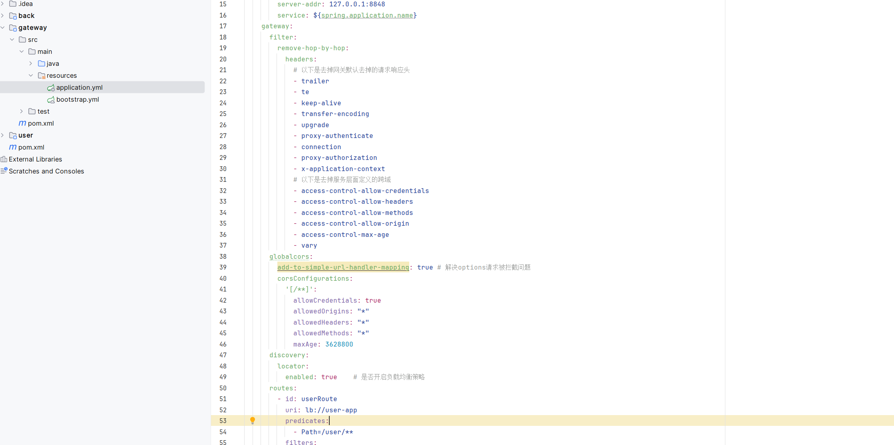

图5.1 微服务项目

系统服务端整体为聚合工程，如图5.1所示，在gateway项目中配置好系统得网关路由，在user与back项目中配置好Nacos服务名称，然后依次启动gateway项目，user项目，back项目，在Nacos终端可以查看服务，如图5.2所示。

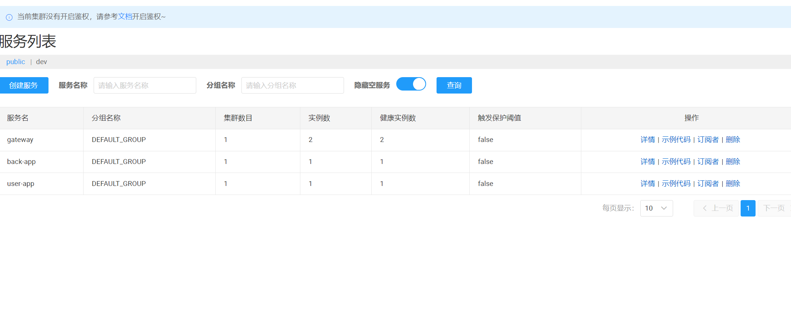

图5.2 Nacos

### 5.2 登录实现

系统登录界面如图5.3所示，是建筑材料管理系统的前端页面之一，采用Vue.js框架实现。用户需输入账号和密码，通过点击登录按钮或按下回车键提交表单。系统验证账号和密码完整性后，调用`checkUser`函数进行身份验证。该函数查询数据库中是否存在该用户名，并检查密码是否匹配。若验证通过，生成访问令牌并存储在本地，同时跳转至系统首页。辅助函数包括`queryByUserName`（根据用户名查询用户信息）、`queryByLimitAccount`（查询用户的限制账户信息）、`queryRightByUserId`（查询用户的权限信息）和`getToken`（生成访问令牌）。密码采用BCryptPasswordEncoder进行加密处理，主要代码：

if (bCryptPasswordEncoder.matches(password, user.getPassword())) {
 Map<String, Object> map = new HashMap<>();
 Integer userId = accountService.queryByLimitAccount(userName, 0, 1).get(0).getId();
 List<Integer> rightList = accountService.queryRightByUserId(userId).stream().map(Right::getNavigationId).collect(Collectors.toList());
 List<String> navigationList = navigationService.queryAllNavigation().stream().filter(navigation -> {
 return rightList.contains(navigation.getId());
 }).collect(Collectors.toList()).stream().map(navigation -> {
 return navigation.getNavigationRoute().replace("/", "");
 }).collect(Collectors.toList());
 Integer rightCount = navigationService.queryAllNavigation().size();
 navigationList = navigationList.size() == rightCount ? new ArrayList<>() : navigationList;
 map.put("navigationList", navigationList);
 map.put("username", userName);
 map.put("token", TokenUtil.getToken(user.getId().toString(), user.getPassword()));

 return new Result("1001", "登录成功", map);
} else {
 return new Result("2001", "密码错误");
}

图5.3 登录

系统首页如图5.4所示，用于展示采购统计信息和相关图表。在创建过程中，首先通过调用 statisticPurchase() 函数获取采购统计数据，然后将返回的数据分别赋值给组件的属性，用于展示采购总金额、采购总数量和消耗总数量。接着，利用 ECharts 库绘制了两个图表：chartBarSupplierQuantityByYear 和 chartLineTotalMoneyByYear，分别展示每年经销商总供货量和每年所花总金额走势。这些图表数据通过调用 drawBarChartSupplierQuantityEveryYear() 和 drawLineChartDealMoneyEveryYear() 方法实现动态绘制。最终，页面呈现出清晰的采购统计信息和直观的图表，帮助用户了解当前的采购情况和趋势变化，主要代码如下所示：

if (type == 1) {//按月统计
 endDate = MonthAndYearDealTools.monthAddOne(endDate);
 list = purchasePlanDao.statisticByUseSelect(startDate+"-01", endDate+"-01");
 xAxisList = MonthAndYearDealTools.monthRangeFromStartDateToEndDate(startDate, endDate);// x轴数据
 mapCategory = dealDataBySelect(list, startDate, endDate,1,2, xAxisList);// 按材料类别处理后的数据
 mapSupplier = dealDataBySelect(list, startDate, endDate, 2,2, xAxisList);// 按经销商处理后的数据
} else {// 按年统计
 startDate = MonthAndYearDealTools.yearAndMonthToYear(startDate);
 endDate = (Integer.parseInt(MonthAndYearDealTools.yearAndMonthToYear(endDate))+1)+"";
 list = purchasePlanDao.statisticByUseSelect(startDate+"-01-01", endDate+"-01-01");
 for (Integer i = Integer.parseInt(startDate); i<Integer.parseInt(endDate); i++) {
 xAxisList.add(i+"");
 }
 mapCategory = dealDataBySelect(list, startDate, endDate,1,1, xAxisList);// 按材料类别处理后的数据
 mapSupplier = dealDataBySelect(list, startDate, endDate, 2,1, xAxisList);// 按经销商处理后的数据
}

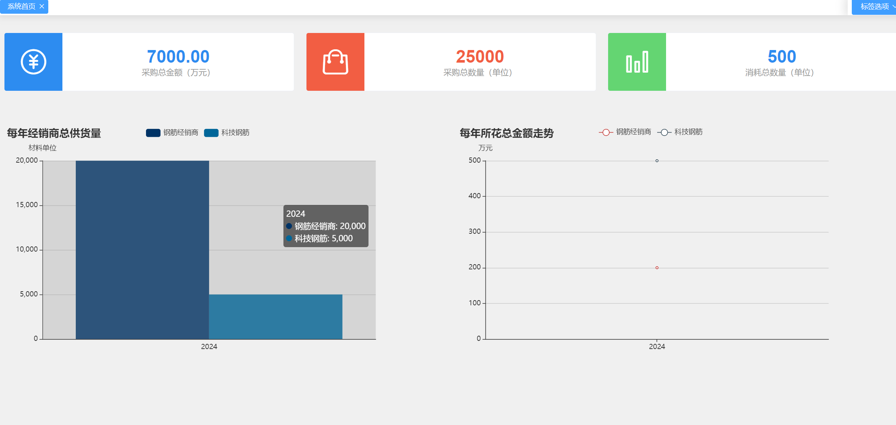

图5.4 系统首页

### 5.3 权限管理实现

#### 5.3.1 用户列表

用户列表界面如图5.5所示，在页面加载时，通过调用 queryByLimitAccountName() 函数获取账户列表数据，并展示在表格中。用户可以根据账户名进行搜索，支持分页导航。对于账户的操作，包括编辑、新增和删除，均通过弹出框的形式实现。编辑弹出框和新增弹出框分别用于编辑账户信息和添加新账户信息，其中使用了表单验证功能确保输入的信息符合要求。账户列表中每行数据的操作列包含编辑、删除和授权功能，用户点击对应的按钮触发相应的操作，关键代码如下所示：

<select id="queryByLimitAccountName" resultMap="UserMap">
 select
 id, username, nickname, create_time, update_time
 from tb_user
 where is_delete = 0
 <if test="username != null and username != ''">
 and username like CONCAT('%',#{username},'%')
 </if>
 limit #{offset}, #{limit}
</select>

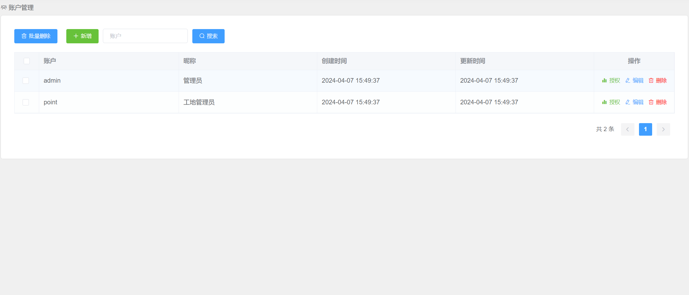

图5.5 用户列表

#### 5.3.2 授权

用户授权弹窗界面如图5.6所示，当用户点击授权按钮后，系统弹出授权弹窗，用户选择权限后，前端通过Axios进行接口访问updateAccountRight接口，在接口中通过调用updateAccountRight方法，进行权限的重新授予，关键代码如下所示：

public Result updateAccountRight(Integer userId, Integer[] checkedValue) {
 this.accountDao.deleteAccountRight(userId);
 int one = this.accountDao.insertAccountRight(checkedValue, userId);
 if (one == checkedValue.length) {
 return new Result("1001", "授权成功");
 } else {
 return new Result("2001", "授权失败");
 }
}

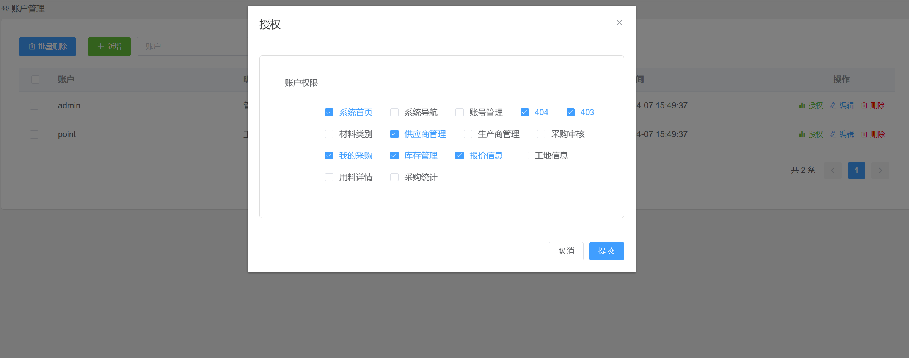

图5.6 授权

### 5.4 报价信息实现

#### 5.4.1 报价信息列表

报价信息列表界面如图5.7所示，界面实现方式与其他列表界面一致，通过ELMUI的Table组件实现，用户可以在此界面进行报价分析，报价导入，查询操作。

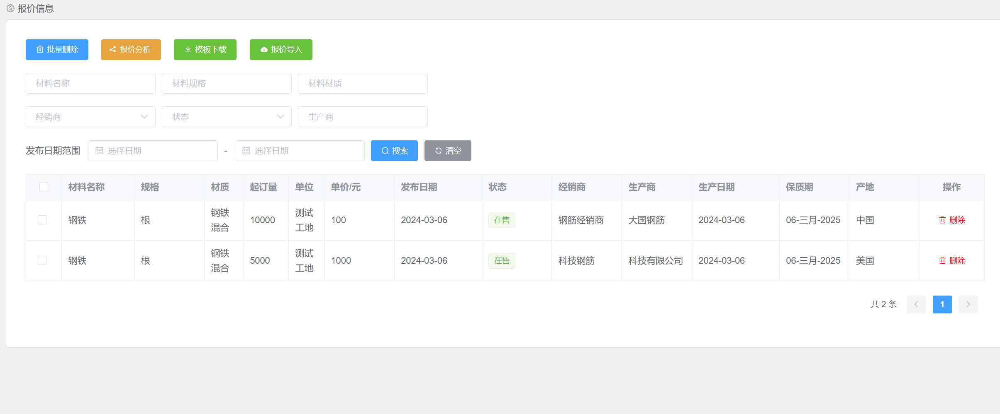

图5.7 报价信息列表界面

#### 5.4.2 报价分析与导入

用户点击报价分析按钮，前端弹出弹窗，通过v-if实现弹窗的显示与隐藏，然后用户输入材料分类与时间查询条件后，请求接口analysisQuotePrice，在接口中首先，通过调用 quotePriceDao.analysisQuotePrice() 方法查询指定材料在给定时间范围内的所有供应商的报价信息。然后，对查询结果进行处理，构建一个供应商和其报价信息的映射关系，存储在 Map<String, Map<String, Double>> 中，其中外层 Map 的键为供应商名称，内层 Map 的键为报价日期，值为报价金额。接着，根据所得到的供应商和报价信息的映射关系，构建图表所需的数据格式，包括 x 轴数据、系列数据和图例数据。最后，将构建好的数据放入一个包含 x 轴数据、系列数据和图例数据的 Map 中，并将其作为成功查询结果返回，前端在通过Echarts实现图表数据绘制，如图5.8所示。

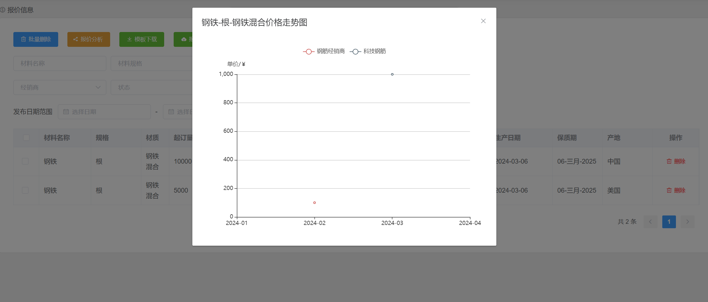

图5.8 报价信息分析

用户选择报价导入，访问系统接口uploadQuotePriceData，接口首先检查上传的文件是否存在，若不存在则返回文件不存在的错误信息。然后，查询所有供应商和工厂信息，并调用 ExcleAnalysisTool 类的 readExecleFile 方法解析上传的 Excel 文件，获取报价信息和其他相关数据。若解析过程中出现错误，则返回相应的错误信息。最后，将解析得到的报价信息批量插入到数据库中，并返回导入成功的消息。若在过程中发生异常，则返回导入失败的消息，关键代码如下所示：

if (uploadFile == null) {
 return new Result("2001", "文件不存在");
}
List<Supplier> supplierList = supplierDao.querySupplierAll();
List<Factory> factoryList = factoryDao.queryFactoryAll();
ExcleAnalysisTool execleAnalysisTool = new ExcleAnalysisTool();
Map<String, Object> map = execleAnalysisTool.readExecleFile(uploadFile, supplierList, factoryList);

if (map.containsKey("error")) {
 return new Result("2001", (String) map.get("error"));
}
List<QuotePrice> list = (List<QuotePrice>)map.get("list");
if (list == null) {
 return new Result("2001", "数据为空");
}
this.quotePriceDao.insertBatch(list);

### 5.5 材料管理实现

#### 5.5.1 材料分类列表

材料分类管理列表如图5.9所示，在页面加载时调用 getByLimitCategory 方法获取材料类别数据并显示在表格中，支持分页展示。用户可以通过输入材料类别名称进行搜索，点击搜索按钮触发搜索操作。对于搜索结果，用户可以进行批量删除操作或选择单个记录进行编辑和删除。点击编辑按钮弹出编辑弹窗，用户可以修改材料类别名称和类别简介，并保存修改。点击新增按钮弹出新增弹窗，用户可以输入新的材料类别信息并保存。保存编辑和新增操作后，会调用相应的 API 方法进行数据更新或插入，并根据返回的结果提示操作成功或失败，关键代码：

@VerifyToken
@RequestMapping(value = "/queryMaterialCategoryWithLimit", method = RequestMethod.GET)
public Result queryMaterialWithLimit(String materialCategoryName, Integer pageIndex, Integer pageSize) {
 return this.materialCategoryService.queryAllByLimit(materialCategoryName, (pageIndex-1)*pageSize, pageSize);
}

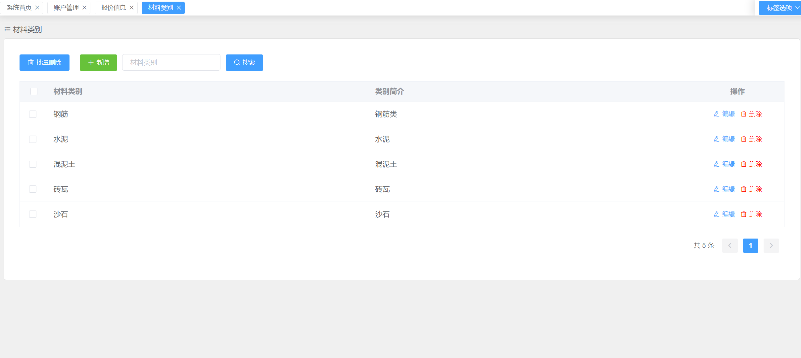

图5.9 材料分类管理

#### 5.5.2 材料分类添加

材料分类添加界面如图5.10所示，用户在材料分类添加弹窗输入完材料分类基本信息后，请求服务端接口: addMaterialCategory服务端首先通过Mapper接口检查要插入的建筑材料类别是否已经存在于数据库中，如果存在则返回错误提示。如果不存在，则调用数据库操作方法将该建筑材料类别插入数据库，成功插入返回新增成功提示，否则返回新增失败提示。

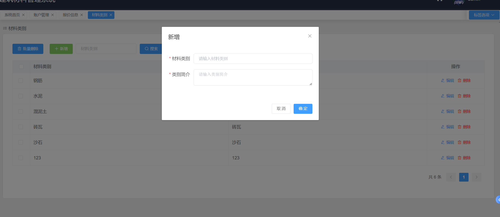

图5.10 材料分类添加

#### 5.5.3 材料列表

材料列表界面如图5.11所示，用户进入该界面，系统前端通过created函数请求服务端接口：queryMaterial，在服务端中首先通过首先通过调用materialStockDao.queryMateial()方法从数据库中获取符合条件的库存信息列表。如果materialQuantity参数为null，则返回所有查询结果及总数；否则，根据材料数量的不同情况，将库存信息分为低于库存下限、在库存范围内、高于库存上限的三类，并分别存储在aList1、aList2和aList3列表中。最后根据materialQuantity参数的值，决定返回哪一类的库存信息及对应的数量。

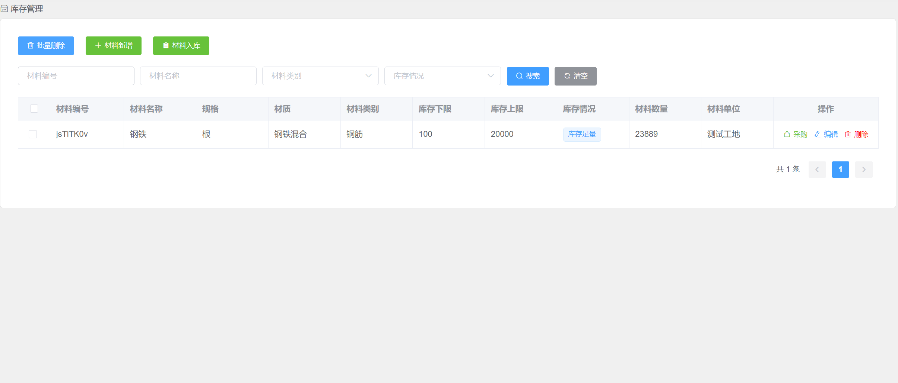

图5.11 材料列表界面

#### 5.5.4 材料添加

用户点击材料新增按钮，前端显示材料新增弹窗界面，界面由Form表单组成，当用户输入完所有信息，点击确定按钮，前端请求服务端接口：addMaterial，服务端调用materialStockService.addMaterial方法，在此方法中通过MyBatis进行Insert语句的执行，完成添加添加，如图5.12所示。

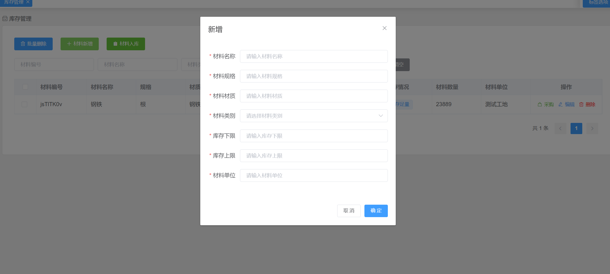

图5.12 材料新增界面

#### 5.5.5 材料入库

用户点击材料入库按钮，系统弹出采购计划选择框，用户选择采购计划后点击确认，前端访问接口完成材料入库，界面如图5.13所示。

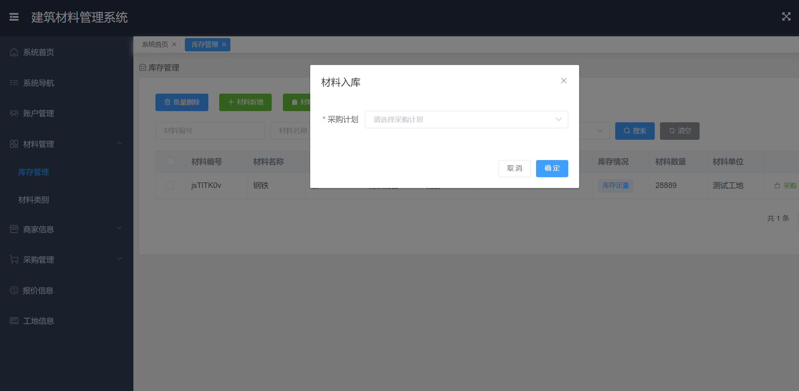

图5.13 材料入库

### 5.6 采购管理实现

#### 5.6.1 采购审核

材料审核列表如图5.14所示，数据获取与搜索功能：通过getPurchasePlan()方法从后端获取采购计划数据，并在页面上提供搜索按钮(handleSearch())，用户可以根据不同条件进行搜索以查找所需的采购计划数据。此外，提供清空搜索框内容的选项(doEmpty())，以便用户在需要时快速清除搜索条件。状态筛选与更新功能：采购计划列表页面允许用户根据不同状态对计划进行筛选(filterTagState(value, row))，从而更便捷地查看特定状态的计划。同时，提供更新状态的功能(handldUpdate(row))，使用户可以将特定状态的计划更新为已采购状态。审核与编辑弹出框：用户可通过点击采购计划列表中的编辑按钮(handleEdit(index, row))来打开审核弹出框，并获取相应的采购计划信息。在弹出框中，用户可以进行审核操作(passPurchasePlan(state))，包括通过或驳回，并填写审核备注。分页导航与日期格式化：为提高用户体验，实现了分页导航功能(handlePageChange(val))，使用户能够方便地浏览和管理大量采购计划数据。另外，通过日期格式化函数(dateFormat(row, column))，将申请时间格式化以便用户更容易地理解和浏览，代码如下所示：

public Result queryPurchasePlanWithLimit(String token, String purchaseNumber, Integer state, String startTime, String endTime, Integer pageIndex, Integer pageSize) {
 String myId = "";
 if (!StringUtils.isEmpty(token)) {
 myId = TokenUtil.getInfoFromToken(token, "id");
 }
 return new Result("1001", "查询成功", this.purchasePlanDao.queryDataWithLimit(myId, purchaseNumber, state, startTime, endTime, pageIndex, pageSize), purchasePlanDao.queryDataCountWithLimit(myId, purchaseNumber, state, startTime, endTime));
}

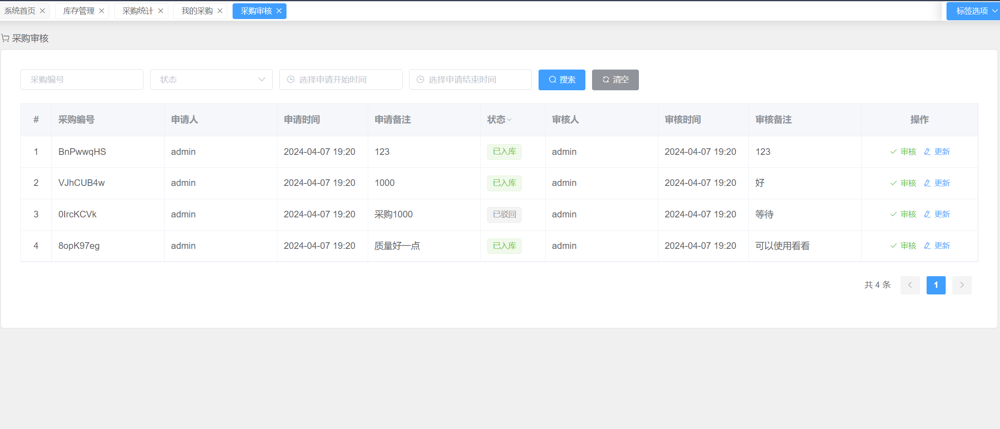

图5.14 采购列表

用户点击审核按钮，即可进行采购审核，如图5.15所示，用户点击通过或者驳回按钮，将访问服务端的接口，服务端通过Update语句修改该采购计划的状态。

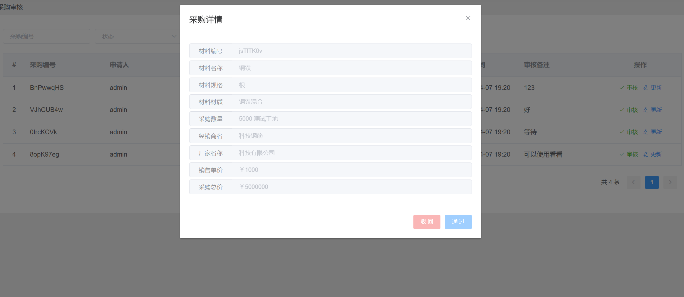

图5.15 采购审核

#### 5.6.2 采购申请

用户在材料管理界面，点击采购即可进行采购申请，输入完所有信息后，系统访问接口applyPurchase，在接口中首先，从用户的token中提取出申请人的ID，然后创建一个新的采购计划对象。在采购计划对象中设置了采购计划编号、申请人ID、材料ID、采购数量、申请理由和供应商ID等信息。

接着，通过调用quotePriceDao的方法查询指定供应商和材料的起购量，以确保采购数量达到供应商的起购量要求。如果申请的采购数量小于供应商的起购量，则返回失败结果，并提示用户该种材料该经销商的起购量。

最后，如果采购计划信息添加成功，则返回成功结果，提示用户采购计划申请成功并等待审核。如果添加失败，则返回失败结果，提示用户申请失败，界面如图5.16所示，申请关键代码：

@Override
public Result applyPurchasePlan(String token, String applyNote, Integer materialId, Integer purchaseQuantity, Integer supplierId) {
 Integer approvalUserId = Integer.parseInt(TokenUtil.getInfoFromToken(token, "id"));
 PurchasePlan purchasePlan = new PurchasePlan();
 purchasePlan.setPurchaseNumber(UuidTools.generateShortUuid()); // 采购计划编号
 purchasePlan.setApplyUserId(approvalUserId); // 申请人id
 purchasePlan.setMaterialId(materialId); //材料id
 purchasePlan.setPurchaseQuantity(purchaseQuantity); // 采购数量
 purchasePlan.setApplyNote(applyNote); // 申请理由
 purchasePlan.setSupplierId(supplierId);
 Integer minLowPurchase = this.quotePriceDao.searchMinPurchase(supplierId, materialId);
 if (minLowPurchase > purchaseQuantity) {
 return new Result("2001", "该种材料该经销商起购量为"+minLowPurchase);
 }
 if(this.purchasePlanDao.addPurchasePlan(purchasePlan) == 1) {
 return new Result("1001", "申请采购成功，请等待审核");
 }
 return new Result("2001", "申请失败");
}

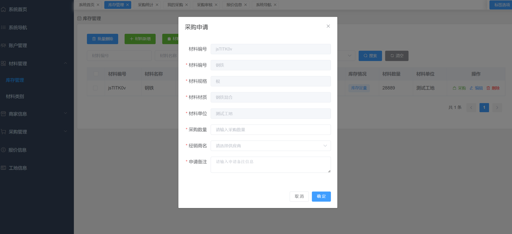

图5.16 采购申请

### 5.7 工地管理实现

#### 5.7.1 工地列表

工地列表界面如图5.17所示，通过调用 querySiteWithLimit 方法获取工地信息列表，并在页面上展示。数据通过 siteInformationData 进行绑定，实现动态渲染。用户可以根据工地名称和状态进行搜索，点击搜索按钮触发 handleSearch 方法进行数据查询，点击清空按钮触发 doEmpty 方法清空搜索框内容。点击编辑按钮触发 handleEdit 方法打开编辑弹出框，编辑完成后点击确定按钮触发 saveEdit 方法保存编辑信息。点击新增按钮触发 handleAdd 方法打开新增弹出框，新增完成后点击确定按钮触发 saveAdd 方法保存新增信息。用户可以单选或多选工地信息进行删除，点击删除按钮或批量删除按钮触发 handleDelete 方法或 delAllSelection 方法执行删除操作。使用 Element UI 中的分页组件 el-pagination 实现分页导航，用户点击分页按钮触发 handlePageChange 方法进行页面切换。

图5.17 工地列表

#### 5.7.2 材料投入使用

工地材料供入界面如图5.18所示，在data属性中定义了组件所需的各种数据，包括查询条件、表格数据、弹出框状态等。在created生命周期钩子中，调用getSiteId()方法获取工地ID，并调用getByLimitUsage()方法获取站点使用数据。getByLimitUsage()方法通过调用getUsage()方法获取站点使用数据，并根据返回结果进行相应的处理，更新UsageData和pageTotal数据。handleSearch()方法用于触发搜索操作，根据用户输入的查询条件重新获取数据并更新显示。handleAppend()和handldUpdateUse()方法分别用于打开追加材料和更新消耗量的弹出框，用户在弹出框中输入数据后，调用saveAppend()和updateUseQuantity()方法进行数据保存。handleAdd()方法用于打开投入材料的弹出框，用户选择材料并输入数量后，调用saveAdd()方法保存数，关键代码：

public Result addUsage(Integer siteId, Integer materialId, Integer putQuantity) {
 Integer stockQuantity = materialStockDao.queryQuantityById(materialId);
 if (putQuantity > stockQuantity) {
 return new Result("2001", "该材料库存中只有"+stockQuantity);
 }
 if (siteInformationDao.addUsageForSite(siteId, materialId, putQuantity) == 1) {
 if (materialStockDao.addMaterialQuantity(materialId, 0-putQuantity) == 1) {
 return new Result("1001", "投入材料成功");
 }
 }
 return new Result("2001", "投入材料失败");
}

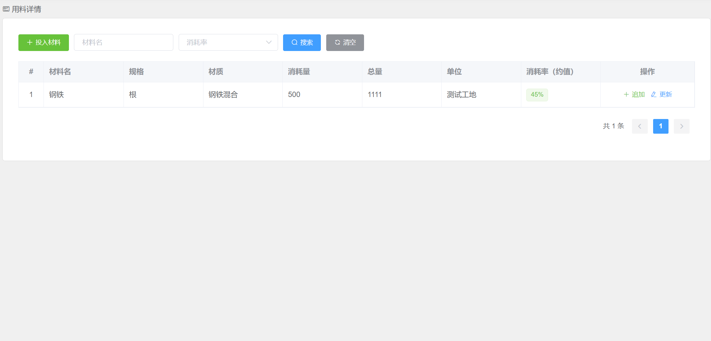

图5.18 材料投入

## 第6章 系统测试

### 6.1 测试环境

系统采用黑盒测试法输入验证：确保系统能够正确处理各种类型的输入，包括有效和无效的输入。例如，对于一个登录页面，可以测试是否能够正确识别有效的用户名和密码，以及是否能够拒绝无效的输入。功能操作：测试系统的各项功能是否按照预期执行。例如，在一个电子商务网站中，测试用户能否成功添加商品到购物车，结账并完成订单。边界测试：测试系统在边界条件下的表现。例如，对于一个要求输入年龄的表单，测试系统能否正确处理最小和最大允许的年龄值。，在Windows10 操作系统，Java8版本，MySQL 8.0版本下进行测试，然后使用的编译器为IDEA 2021，前端的环境为Node.js 14。

### 6.2 测试用例

登录测试主要测试用户输入的账号与密码是否经过系统的验证，不同权限的用户登入成功看到的界面是否与设置的权限一致，具体如表6.1登录所示。

表6.1 登录

<table>
<tr><td colspan="2">功能描述</td><td colspan="5">登录</td></tr>
<tr><td colspan="2">所属模块</td><td colspan="5">登录</td></tr>
<tr><td colspan="2">用例目的</td><td colspan="5">登录逻辑是否生效</td></tr>
<tr><td colspan="2">前提条件</td><td colspan="5">账号为admin,123456且拥有所有权限的用户，账号为cs，123456只有工地管理权限的用户</td></tr>
<tr><td>用例ID</td><td colspan="2">输入/动作</td><td>期望结果</td><td>实际情况</td><td>通过/失败</td><td>执行人员</td></tr>
<tr><td>1</td><td colspan="2">输入admin账号和密码，点击登录按钮</td><td>成功登录，进入首页</td><td>与期望一致</td><td>通过</td><td>测试</td></tr>
<tr><td>2</td><td colspan="2">输入cs账号和密码，点击登录按钮</td><td>成功登录，进入工地管理界面</td><td>与期望一致</td><td>通过</td><td>测试</td></tr>
<tr><td>3</td><td colspan="2">输入错误的账号和密码，点击登录按钮</td><td>显示登录失败提示信息</td><td>与期望一致</td><td>通过</td><td>测试</td></tr>
<tr><td>4</td><td colspan="2">不输入账号和密码，点击登录按钮</td><td>显示登录失败提示信息</td><td>与期望一致</td><td>通过</td><td>测试</td></tr>
</table>

材料管理流程主要测试材料分类列表获取，材料分类添加，材料列表获取，材料添加功能是否正常，如表6.2所示。

表6.2 材料管理

<table>
<tr><td colspan="2">功能描述</td><td colspan="5">材料管理</td></tr>
<tr><td colspan="2">所属模块</td><td colspan="5">材料管理</td></tr>
<tr><td colspan="2">用例目的</td><td colspan="5">测试整个材料管理流程的规范性</td></tr>
<tr><td colspan="2">前提条件</td><td colspan="5">无</td></tr>
<tr><td>用例ID</td><td colspan="2">输入/动作</td><td>期望结果</td><td>实际情况</td><td>通过/失败</td><td>执行人员</td></tr>
<tr><td>1</td><td colspan="2">打开材料分类列表页面，查看材料分类列表</td><td>显示当前系统中的所有材料分类，列表展示正常</td><td>与期望一致</td><td>通过</td><td>测试</td></tr>
<tr><td>2</td><td colspan="2">在材料分类列表页面，点击添加材料分类按钮</td><td>弹出添加材料分类的模态框，输入信息后成功添加材料分类</td><td>与期望一致</td><td>通过</td><td>测试</td></tr>
<tr><td>3</td><td colspan="2">打开材料列表页面，查看材料列表</td><td>显示当前系统中的所有材料，列表展示正常</td><td>与期望一致</td><td>通过</td><td>测试</td></tr>
<tr><td>4</td><td colspan="2">在材料列表页面，点击添加材料按钮</td><td>弹出添加材料的模态框，输入信息后成功添加材料</td><td>与期望一致</td><td>通过</td><td>测试</td></tr>
<tr><td>5</td><td colspan="2">在材料列表页面，点击编辑已有材料按钮</td><td>弹出编辑材料的模态框，可以成功编辑已有材料的信息</td><td>与期望一致</td><td>通过</td><td>测试</td></tr>
</table>

报价信息模块主要测试报价列表获取，报价导入流程是否正常，结果如表6.3所示。

表6.3 报价信息

<table>
<tr><td colspan="2">功能描述</td><td colspan="5">报价信息</td></tr>
<tr><td colspan="2">所属模块</td><td colspan="5">报价信息</td></tr>
<tr><td colspan="2">用例目的</td><td colspan="5">测试整个报价信息流程的规范性</td></tr>
<tr><td colspan="2">前提条件</td><td colspan="5">无</td></tr>
<tr><td>用例ID</td><td colspan="2">输入/动作</td><td>期望结果</td><td>实际情况</td><td>通过/失败</td><td>执行人员</td></tr>
<tr><td>1</td><td colspan="2">打开报价列表页面，查看报价列表</td><td>显示当前系统中的所有报价信息，列表展示正常</td><td>与期望一致</td><td>通过</td><td>测试</td></tr>
<tr><td>2</td><td colspan="2">在报价列表页面，点击导入报价按钮</td><td>弹出报价导入的模态框，成功导入报价信息</td><td>与期望一致</td><td>通过</td><td>测试</td></tr>
<tr><td>3</td><td colspan="2">打开报价详情页面，查看报价详情</td><td>显示指定报价信息的详细内容，信息展示正常</td><td>与期望一致</td><td>通过</td><td>测试</td></tr>
<tr><td>4</td><td colspan="2">在报价详情页面，点击编辑报价按钮</td><td>弹出编辑报价的模态框，可以成功编辑已有报价的信息</td><td>与期望一致</td><td>通过</td><td>测试</td></tr>
<tr><td>5</td><td colspan="2">在报价详情页面，点击删除报价按钮</td><td>删除指定报价信息，删除成功后列表数据更新</td><td>与期望一致</td><td>通过</td><td>测试</td></tr>
</table>

采购模块主要测试，采购申请中是否与报价信息进行了联动，主要测试采购审核是否正常，审核通过后，材料是否可以正常入库，结果如表6.4所示。

表6.4 采购

<table>
<tr><td colspan="2">功能描述</td><td colspan="5">采购</td></tr>
<tr><td colspan="2">所属模块</td><td colspan="5">采购</td></tr>
<tr><td colspan="2">用例目的</td><td colspan="5">测试整个采购流程的规范性</td></tr>
<tr><td colspan="2">前提条件</td><td colspan="5">无</td></tr>
<tr><td>用例ID</td><td colspan="2">输入/动作</td><td>期望结果</td><td>实际情况</td><td>通过/失败</td><td>执行人员</td></tr>
<tr><td>1</td><td colspan="2">打开采购申请页面，填写申请信息并提交申请</td><td>申请信息成功提交，与报价信息联动正常</td><td>与期望一致</td><td>通过</td><td>测试</td></tr>
<tr><td>2</td><td colspan="2">打开采购审核页面，审核通过申请</td><td>申请成功审核通过，材料可以正常入库</td><td>与期望一致</td><td>通过</td><td>测试</td></tr>
<tr><td>3</td><td colspan="2">打开材料库存页面，查看入库列表</td><td>显示当前系统中的所有入库信息，列表展示正常</td><td>与期望一致</td><td>通过</td><td>测试</td></tr>
<tr><td>4</td><td colspan="2">在入材料库存页面，点击确认入库按钮</td><td>选择指定材料进行入库操作，入库成功</td><td>与期望一致</td><td>通过</td><td>测试</td></tr>
<tr><td>5</td><td colspan="2">打开材料库存页面，查看库存信息</td><td>显示当前系统中的所有材料库存信息，信息展示正常</td><td>与期望一致</td><td>通过</td><td>测试</td></tr>
</table>

## 第7章 总结与展望

在建筑材料管理系统的开发过程中，我们充分利用了现代化的技术和架构，以实现系统的各项功能。系统涵盖了用户管理、权限管理、采购管理、材料管理、工地管理和报价管理等核心功能。通过Spring Boot作为后端框架，结合Nacos作为服务注册与发现中心，实现了微服务架构的应用部署与管理。数据库采用MySQL，并利用MyBatis框架实现了数据持久化。前端界面使用Vue.js框架实现了用户友好的交互界面。

在用户管理方面，我们实现了用户信息的增删改查功能，并通过权限管理模块实现了对用户权限的精细化控制，确保系统安全可靠。采购管理模块实现了对材料采购计划的申请和审核，有效管理了材料采购流程。材料管理模块则提供了材料信息的录入和查询功能，方便用户随时获取材料相关信息。工地管理模块实现了工地信息的录入和查询，有助于管理者对工地情况的掌控。报价管理模块实现了对材料的报价信息录入和查询，为用户提供了材料价格的参考。

总体而言，我们通过技术的应用和功能的实现，为建筑材料管理提供了一套完整的解决方案。通过微服务架构的应用，系统具有良好的拓展性和灵活性，能够满足未来业务发展的需要。同时，借助现代化的前后端技术，我们为用户提供了友好、高效的使用体验，提升了管理效率和工作效益。建筑材料管理系统的开发过程中，我们不断学习和进步，深化了对技术和业务的理解，也积累了宝贵的经验。在未来，我们将继续致力于系统的优化和升级，为用户提供更加优质的服务和体验。

不足：在建筑材料管理系统的开发过程中，尽管我们充分利用了现代化技术和架构，但也存在一些不足之处。其中，一个主要的不足是对于系统的性能和扩展性的考虑不够充分。虽然我们采用了微服务架构，但在面对大规模数据和高并发请求时，系统可能会出现性能瓶颈，需要进一步优化和扩展。此外，对于用户的反馈和需求响应不够及时也是需要改进的地方，我们需要建立更加灵活的反馈机制，及时调整和改进系统功能，以满足用户的实际需求。在未来的系统优化和升级中，我们将重点关注性能优化和用户体验改进，以提升系统的整体质量和用户满意度。
